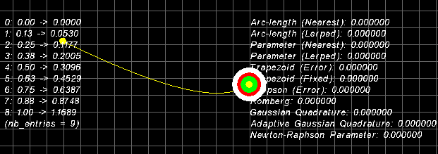

# ARC-LENGTH PARAMETERISATION
*Don Williamson (@donzanoid) 4 August, 2002*

Well, I'm in southern France having a whale of a time on a camp-site in beautiful weather,
so what a perfect time this would be to look at arc-length parameterisation! This zip
contains a little bit of the research I did while on holiday, geared towards various
techniques in animation. Hopefully it should make this information more accessible to those
who find themselves involved with all this stuff for whatever reason.

To compile this source fully you're going to need SDL (a brilliant piece of work) and
my SDLApp framework, which should be available on my website. Go to www.libsdl.org for
all SDL-related info.

The simple goal of this exercise is to be able to accurately control the speed at which
parameters interpolate over any given type of curve.

	

## Program key
---

The columns down the left of the screen display the arc-length/parameter pairs in
the adaptive or fixed tables. The values on the right are the various arc-lengths and
parameters generated by the numerous techniques implemented in this code. The `yellow` line
with two circles at each end is a randomnly generated cubic curve. You can generate others
by pressing the `[SPACE]` bar. The `white ring` is moving at a constant speed along the curve,
you can see this speed at the bottom right hand side of the screen. The `red ring` is
moving via a simple sine ease function and the `green ring` is moving via another ease
function which provides constant velocity within parametric bounds.

The different parameterisation methods are discussed below.

## Fixed-size table lookup
---

Step along the curve at fixed intervals sampling the points. For each point you sample
store it's parametric value along with distance from the beginning of the curve in a
table.

Mapping from parameter value to arc-length involves simply dividing the parameter
value by the interval size and using that as an index into the table, finding the
nearest arc-length. Less coarse arc-lengths are also provided by linearly interpolating
between the two closest table entries.

Mapping from arc-length to parameter value is done through a binary search on the
arc-length values which is reasonably fast for picking random points on the curve. Even
better results can be obtained by using a correlated search algorithm on the arc-lengths
such as the hunt function in Numerical Recipes, but only if you're following the path
rather than picking random points on it.

## Adaptive-size table lookup
---

A fixed-size table will undersample areas of high non-linearity and invest wasted time
in oversampling highly linear areas. Use recursive subdivision to generate a table that
plots more samples in areas of high non-linearity.

Mapping from parameter value to arc-length is not so simple this time because the sample
points aren't evenly spaced. A binary search, or hunt, can be used in this scenario, again
linearly interpolating between successive entries when the nearest has been found.

Mapping from arc-length to parameter value is exactly the same as doing it for a fixed
size table.

## Numerical integration techniques
---

The arc-length integral:

	integral[modulus[dP/du], u0, u1]

cannot be analytically solved so you can use a selection of algorithms to approximate
the integral. Mapping from parameter value to arc-length can be done in a number of ways,
including the following (all in the source):

## Extended trapezoidal rule
---

Very basic sampling of the function to be integrated at evenly spaced intervals
with non-varying weights. Can be done using a fixed interval size or adaptive
sample size through recursive refinement of the approximation.

## Simpson's rule
---

A simple extension of the trapezoidal rule where the approximation is calculated
in pairs of sucsessive trapezoidal refinements, and weighted so as to cancel out
the leading error term introduced by the first pass.

## Romberg integration
---

Simpsons rule is a special case of romberg integration, which is used for
integration schemes that are of a higher order than Simpson's rule. Polynomial
extrapolation is used to cancel out leading error terms, of which, the pair
approach in Simpson's rule is again a special case.

## Lagrange polynomial interpolation
---

For every point set containing N points there exists a unique polynomial of
order N-1 that interpolates through those points (e.g. for 2 points there
exists a unique line that interpolates through them). This simple brute
force algorithm will evaluate that polynomial at any given point, given
the point list.

## Neville Polynomial interpolation
---

An improvement on lagrange which recursively works up from polynomials of
zero'th order to the desired order. Much faster than lagrange, and provides
an error estimate as a result of the interpolation/extrapolation.

## Gaussian quadrature
---

Uses unevenly spaced intervals in an attempt to get the greatest accuracy using
the smallest number of function evaluations. Hence this is a very efficient
algorithm and the numerical integration algorithm of choice. This algorithm
can allow as much as twice much order as that in previous algorithms which can
mean much higher accuracy if the function can be well-approximated by a polynomial.

Mapping from arc-length to parameter value can be done with newton-raphson iteration,
where:

	Pn+1 = Pn - f(Pn)/f'(Pn)
	f(Pn) = Arc-length integral at Pn
	f'(Pn) = dP/du evaluated at Pn

The iteration converges very quickly on the root and requires little calculation at each
iteration.

## Adaptive gaussian quadrature
---

Gaussian quadrature, just like fixed-size table lookups, is capable of oversampling and
undersampling. This can be solved by using an adaptive gaussian method. Build an
adaptive-size lookup table as in method (2) but use gaussian quadrature to approximate
the arc-lengths instead of simple linear distance.

Mapping from parameter value to arc-length is first of all done by locating the nearest
parameter value below your search value using a binary search as in method (2). Then
instead of linearly interpolating the located arc-length, use gaussian quadrature to
calculate the arc-length from the located parameter to your requested parameter; the
parameter range having been reduced enough to make this gaussian quadrature approximation
very accurate.

Mapping from arc-length to parameter value can be done as with the numerical integration
techniques since the arc-length integral needs to be evaluated at each iteration, making
it an already adaptive evaluation.

## Final notes
---

The most accurate combination I've found is adaptive gaussian quadrature for mapping
parameter to arc-length, combined with newton-raphson iteration for mapping arc-length
to parameter. The newton-raphson stage can be accelerated greatly by doing a binary
(or correlated) search through the table built by the AGQ routine and linearly
interpolating between closest parameter values to generate the initial guess for the
iteration. The remaining steps only require a few iterations of Newton-Raphson to
get very close to the real root in a very efficient manner.

The current implementation (compiled EXE) contains the above methods as default and you
can see by looking at the speed parameter how accurate the methods really are. As a
comparison, if you replace all calls to GetParameterNewtonRaphson() with calls to
GetParameterAdaptiveLerped(), you'll notice a large change in the variability of the
speed parameter.

Additionally, the added accuracy of gaussian quadrature and newton-raphson allow the
table sizes to be a lot smaller than the linear-distance based methods.

## References

* Rick Parent, "Computer Animation, Algorithms and Techniques"
* William H. Press et al, "Numerical Recipes in C"

